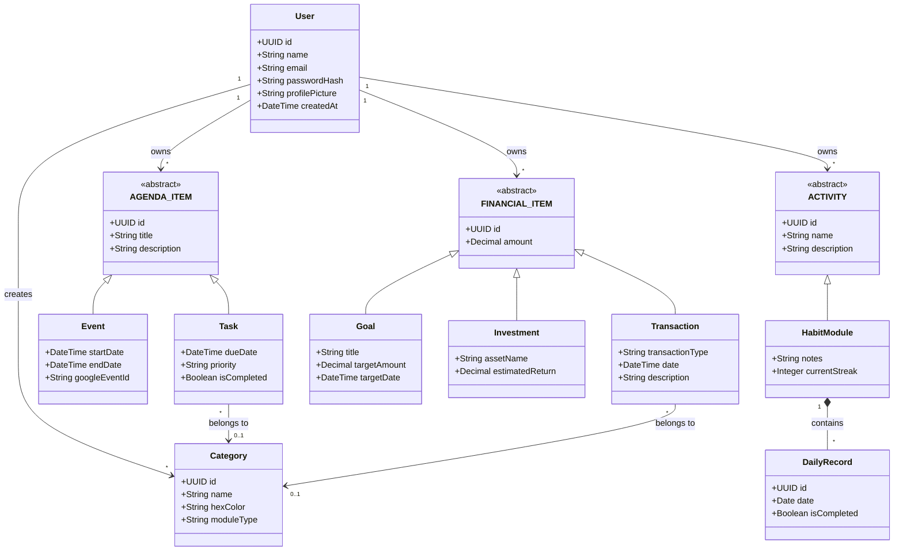

```mermaid
classDiagram
    %% --- MAIN CLASSES ---
    class User {
        +UUID id
        +String name
        +String email
        +String passwordHash
        +String profilePicture
        +DateTime createdAt
    }

    class Category {
        +UUID id
        +String name
        +String hexColor
        +String moduleType
    }

    %% --- SCHEDULE MODULE ---
    class AGENDA_ITEM {
        <<abstract>>
        +UUID id
        +String title
        +String description
    }

    class Task {
        +DateTime dueDate
        +String priority
        +Boolean isCompleted
    }

    class Event {
        +DateTime startDate
        +DateTime endDate
        +String googleEventId
    }

    %% --- FINANCE MODULE ---
    class FINANCIAL_ITEM {
        <<abstract>>
        +UUID id
        +Decimal amount
    }

    class Transaction {
        +String transactionType
        +DateTime date
        +String description
    }

    class Goal {
        +String title
        +Decimal targetAmount
        +DateTime targetDate
    }

    class Investment {
        +String assetName
        +Decimal estimatedReturn
    }

    %% --- ACTIVITIES & HABITS MODULE ---
    class ACTIVITY {
        <<abstract>>
        +UUID id
        +String name
        +String description
    }

    class HabitModule {
        +String notes
        +Integer currentStreak
    }

    class DailyRecord {
        +UUID id
        +Date date
        +Boolean isCompleted
    }

    %% --- INHERITANCE ---
    AGENDA_ITEM <|-- Task
    AGENDA_ITEM <|-- Event

    FINANCIAL_ITEM <|-- Transaction
    FINANCIAL_ITEM <|-- Goal
    FINANCIAL_ITEM <|-- Investment

    ACTIVITY <|-- HabitModule

    %% --- RELATIONSHIPS ---
    User "1" --> "*" AGENDA_ITEM : owns
    User "1" --> "*" FINANCIAL_ITEM : owns
    User "1" --> "*" ACTIVITY : owns
    User "1" --> "*" Category : creates

    Task "*" --> "0..1" Category : belongs to
    Transaction "*" --> "0..1" Category : belongs to

    HabitModule "1" *-- "*" DailyRecord : contains
```
