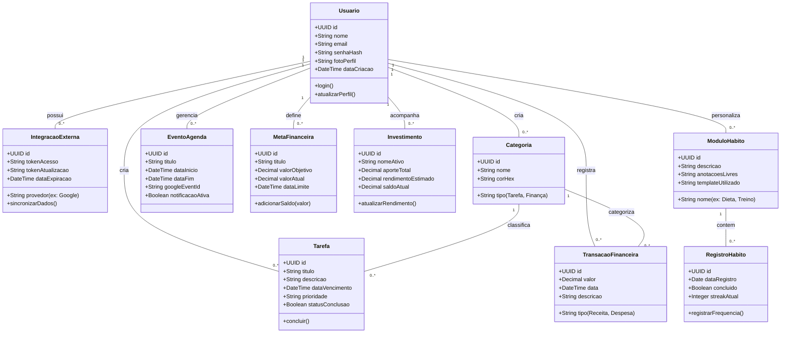

```mermaid
classDiagram
class Usuario {
+UUID id
+String nome
+String email
+String senhaHash
+String fotoPerfil
+DateTime dataCriacao
+login()
+atualizarPerfil()
}

    class IntegracaoExterna {
        +UUID id
        +String provedor (ex: Google)
        +String tokenAcesso
        +String tokenAtualizacao
        +DateTime dataExpiracao
        +sincronizarDados()
    }

    class Categoria {
        +UUID id
        +String nome
        +String corHex
        +String tipo (Tarefa, Finança)
    }

    class Tarefa {
        +UUID id
        +String titulo
        +String descricao
        +DateTime dataVencimento
        +String prioridade
        +Boolean statusConclusao
        +concluir()
    }

    class EventoAgenda {
        +UUID id
        +String titulo
        +DateTime dataInicio
        +DateTime dataFim
        +String googleEventId
        +Boolean notificacaoAtiva
    }

    class TransacaoFinanceira {
        +UUID id
        +Decimal valor
        +String tipo (Receita, Despesa)
        +DateTime data
        +String descricao
    }

    class MetaFinanceira {
        +UUID id
        +String titulo
        +Decimal valorObjetivo
        +Decimal valorAtual
        +DateTime dataLimite
        +adicionarSaldo(valor)
    }

    class Investimento {
        +UUID id
        +String nomeAtivo
        +Decimal aporteTotal
        +Decimal rendimentoEstimado
        +Decimal saldoAtual
        +atualizarRendimento()
    }

    class ModuloHabito {
        +UUID id
        +String nome (ex: Dieta, Treino)
        +String descricao
        +String anotacoesLivres
        +String templateUtilizado
    }

    class RegistroHabito {
        +UUID id
        +Date dataRegistro
        +Boolean concluido
        +Integer streakAtual
        +registrarFrequencia()
    }

    Usuario "1" -- "0..*" IntegracaoExterna : possui
    Usuario "1" -- "0..*" Tarefa : cria
    Usuario "1" -- "0..*" EventoAgenda : gerencia
    Usuario "1" -- "0..*" TransacaoFinanceira : registra
    Usuario "1" -- "0..*" MetaFinanceira : define
    Usuario "1" -- "0..*" Investimento : acompanha
    Usuario "1" -- "0..*" ModuloHabito : personaliza
    Usuario "1" -- "0..*" Categoria : cria

    Categoria "1" -- "0..*" Tarefa : classifica
    Categoria "1" -- "0..*" TransacaoFinanceira : categoriza

    ModuloHabito "1" -- "0..*" RegistroHabito : contem

```
